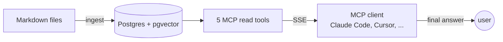
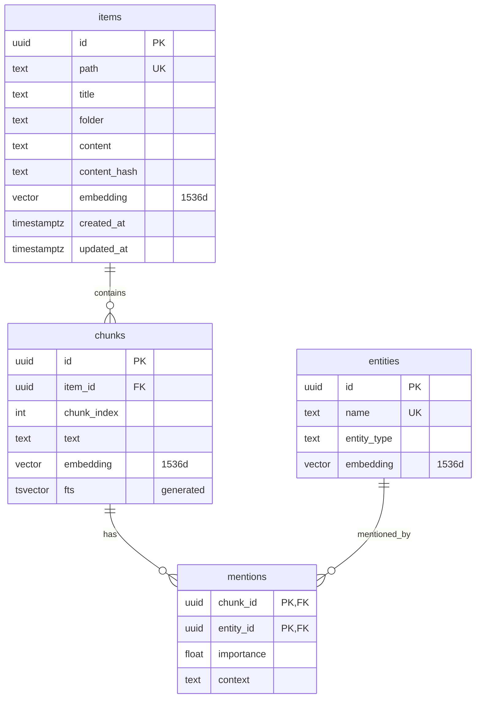
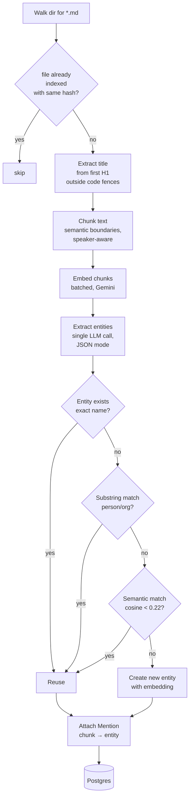
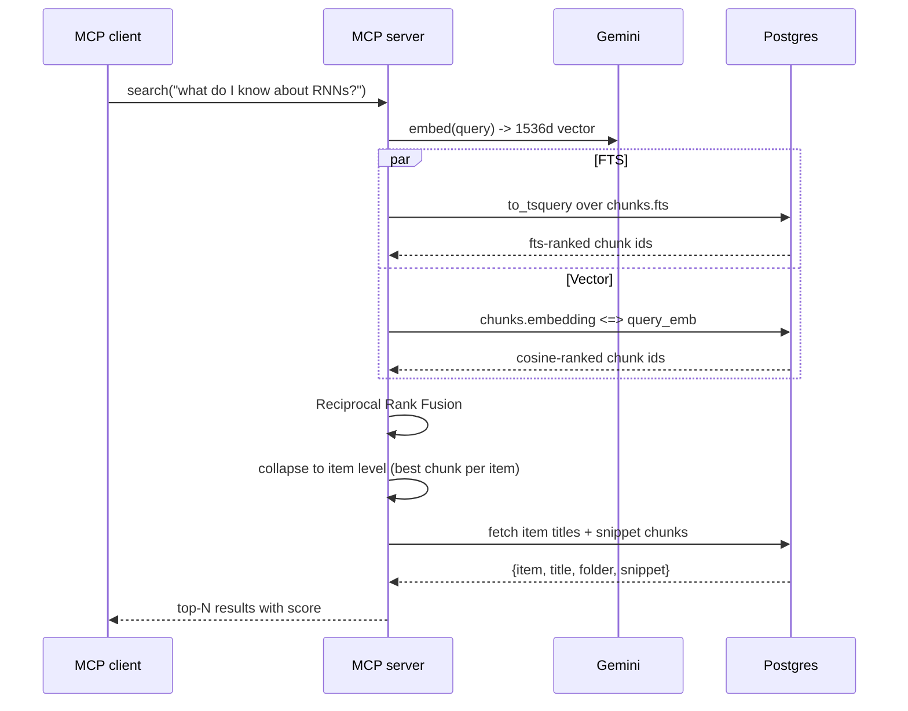
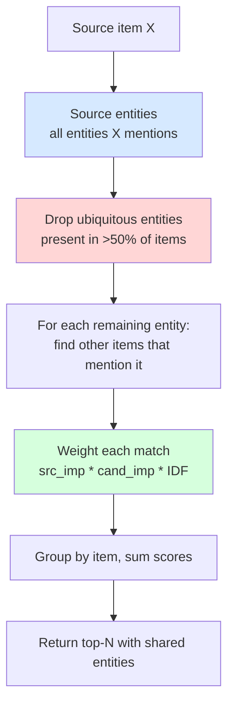
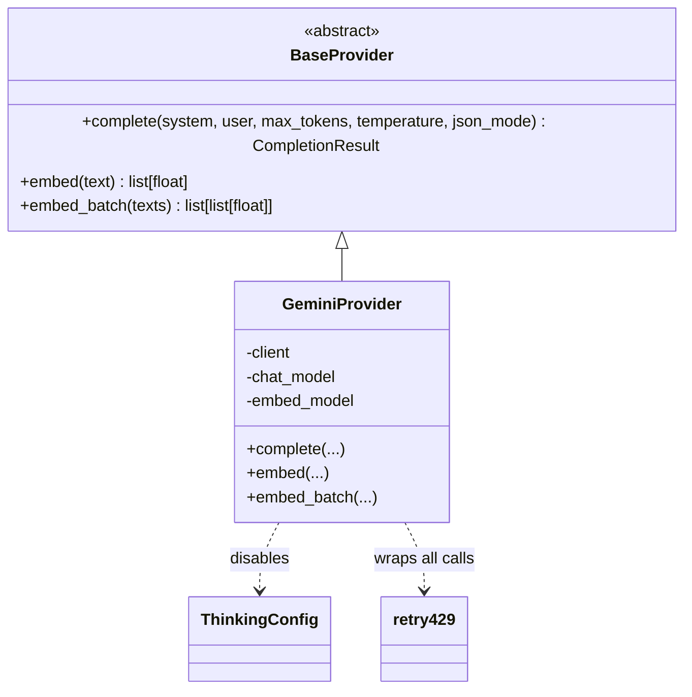

# Architecture

How `korely-graphrag` works internally — enough detail to contribute
confidently, not enough to drown in.

---

## 10-second mental model

The server is a **pure data provider**. Zero LLM calls happen at query time
on the server — synthesis is done by whatever LLM the MCP client runs.
That's what makes it fast, cheap, and vendor-neutral for the consumer.

---

## Data model

Four tables in Postgres, pgvector extension required.

- `items` — one row per markdown file
- `chunks` — text segments of an item, with per-chunk embeddings + Postgres-generated `tsvector` for FTS
- `entities` — named things extracted from the corpus (person, organization, technology, concept, location, topic, fact, decision, evidence, reasoning, action_item)
- `mentions` — many-to-many edge `(chunk, entity)` with per-mention importance

Files: [`src/korely_graphrag/storage/models.py`](src/korely_graphrag/storage/models.py)

---

## Ingest pipeline

Key properties:
- **Idempotent** — a file with unchanged `content_hash` is skipped.
- **Three-layer dedup** — exact name, then substring (for person/org), then embedding cosine. In that order, cheapest first.
- **One Gemini entity call per document** — not per chunk. We send the whole doc trimmed to 10k chars.
- **Graceful degradation** — if the embed call fails for any reason, we fall back to name-only dedup (no semantic match attempted).

Files: [`src/korely_graphrag/ingest/pipeline.py`](src/korely_graphrag/ingest/pipeline.py), [`src/korely_graphrag/ingest/entity_extractor.py`](src/korely_graphrag/ingest/entity_extractor.py)

---

## Query pipeline — `search(query)`

No LLM call besides the query embedding. RRF is just:
`score(item) = sum over retrieval systems of 1 / (60 + rank_in_system)`,
with the best-scoring chunk per item chosen as the representative.

Files: [`src/korely_graphrag/search/hybrid.py`](src/korely_graphrag/search/hybrid.py), [`src/korely_graphrag/mcp_server/tools.py`](src/korely_graphrag/mcp_server/tools.py)

---

## The killer feature — `get_related(item_id)`

Given a note, find other notes that share *meaning*, not just *keywords*.

Two critical ideas:

1. **Ubiquity hard filter.** An entity that appears in more than 50% of the
corpus (e.g. the blog author across all posts, or a company name on every meeting note) is treated as structurally noisy and dropped before
the traversal. This is a defense-in-depth check.

2. **IDF weighting on the score.** Instead of counting each shared entity
equally, each is weighted by `log(N / doc_freq)`. An entity in 6/24 docs
contributes `log(4) ≈ 1.39`; an entity in 1/24 docs contributes
`log(24) ≈ 3.18`. Rare shared entities dominate the score, as they should.

Implementation: one SQL CTE chain, no Python-side iteration. Runs in ~7ms
on a 24-doc corpus (vs ~450ms for a naive "search by title" fallback).

File: [`src/korely_graphrag/search/graph.py`](src/korely_graphrag/search/graph.py)

---

## MCP tool surface

Five read tools. All of them return JSON-serializable dicts, no LLM
synthesis server-side:

| Tool | Purpose |
|---|---|
| `search(query, limit)` | Hybrid FTS + vector search |
| `read_item(item_id)` | Full content + metadata for one item |
| `get_related(item_id, limit)` | Graph traversal (the feature above) |
| `list_notes(folder, limit, offset)` | Paginated browse |
| `list_folders()` | Folder counts across the corpus |

The MCP server is built on [FastMCP](https://github.com/jlowin/fastmcp).
SSE transport, stateless, no auth (single-user local tool).

File: [`src/korely_graphrag/mcp_server/server.py`](src/korely_graphrag/mcp_server/server.py)

---

## Provider abstraction

LLM + embedding calls go through a small abstract layer so we can swap
providers without touching pipelines. Day 1: Gemini only. Ollama is on
the roadmap.

- Gemini 2.5 Flash is used for entity extraction with `thinking_budget=0`
  (thinking tokens waste output budget in JSON mode).
- All calls wrapped in `_retry_on_429` with exponential backoff — survives
  the aggressive free-tier rate limits.
- Embeddings use `gemini-embedding-001` with `output_dimensionality=1536`
  to match the pgvector column width.

File: [`src/korely_graphrag/providers/gemini.py`](src/korely_graphrag/providers/gemini.py)

---

## Testing

49 tests — a mix of pure unit tests (chunker, entity normalization,
dedup heuristics, tsquery sanitization) and Postgres integration tests
(schema, hybrid search, graph traversal, MCP tool results, full ingest
pipeline with a fake provider).

See [`tests/`](tests/) — in particular `test_fixes.py` for the three
quality fixes described in the commit log (hub-node filter, semantic
dedup, title extraction robustness) and the round-2 IDF + substring
additions.

---

## What's deliberately NOT in this repo

This is the OSS retrieval core. Korely (the commercial product) adds:

- Auto folder classification at save time
- Intent detection ("this is a task" vs "this is a note")
- Memory decay / spaced-repetition salience job
- Meeting recording + diarization + summary
- Multi-user auth, Stripe billing, quotas
- A full chat pipeline with reranker, title boost, depth selection, inline citations
- Rich TipTap editor UI
- The hosted **`get_context()` memory layer** — bi-temporal facts + contradiction resolution that build the ~2,000-token block behind the [LongMemEval 76-vs-42 result](token-savings/). That *selection* runs in the cloud, not here; the open engine in this repo is the retrieval core it is built on (`search`, `get_related`, the entity graph).

If you want those, see [korely.ai](https://korely.ai). If you want a
self-hosted MCP-backed second brain with a proper entity graph, this repo
is for you.
