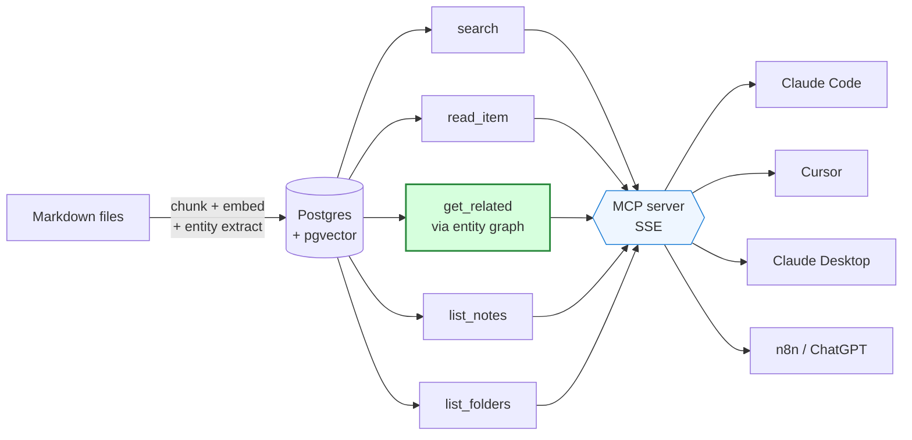

# korely-graphrag

[](LICENSE)
[](https://www.python.org/downloads/)
[](tests/)
[](https://modelcontextprotocol.io/)
[](https://ai.google.dev/)

> The open retrieval engine behind [Korely](https://korely.ai): an entity-graph "second brain" for your markdown notes, served over MCP — it surfaces the connections you never wrote down.

**Status:** Apache 2.0 · reproducible benchmarks included · early preview, single-user, CLI-first

### The one number

On the public **LongMemEval** benchmark, at an **equal token budget**, a reader answers **76% of questions correctly from Korely's selected memory block versus 42% from a same-size recency window** — same cost, **1.8× the answers right**, and within ~7 points of re-sending the *entire* history (83.1%) at a third of the tokens.

That selection number is produced by Korely's hosted `get_context()` — the cloud memory layer — and you reproduce it from this repo against the free API. The **open engine in this repo** (`src/`) is the retrieval core (hybrid search + the entity graph); it reproduces the [retrieval benchmark](BENCHMARK.md) (p@1 0.50 vs 0.00 vs vanilla RAG). Full method + raw per-answer data: [token-savings/](token-savings/).

---

## Start here

This repo is two things in one place: the open-source retrieval engine that powers [Korely](https://korely.ai), and two honest, reproducible benchmarks that show what it buys you. Pick the door that matches why you came.

| If you want... | Go here |
|---|---|
| To run it on your own markdown notes | [Quickstart](#quickstart) |
| The **memory-quality** result: 76% vs 42% correct at equal token budget (Korely's hosted memory) | [token-savings/](token-savings/) |
| The **retrieval** result (entity graph vs vanilla RAG, p@1 0.50 vs 0.00) | [BENCHMARK.md](BENCHMARK.md) |
| To understand how it works inside (4 diagrams) | [ARCHITECTURE.md](ARCHITECTURE.md) |
| The 30-second pitch | [What it is](#what-it-is) |

## Map of this repo

```
korely-graphrag/
├── src/korely_graphrag/   the engine: chunk + embed + entity-extract + hybrid search, served over MCP
├── token-savings/         memory-quality + token benchmarks on LongMemEval (dashboards, data, results)
├── benchmark/             retrieval benchmark: entity graph vs vanilla RAG vs nano-graphrag (corpus + scripts)
├── tests/                 pytest suite — 49 tests (36 need a live Postgres; 13 run standalone)
├── docs/images/           demo screenshots used below
├── notes/                 drop your own *.md here to index them
├── BENCHMARK.md           writeup of the retrieval benchmark
├── ARCHITECTURE.md        ingest / query / graph-traversal pipelines, with diagrams
└── README.md              you are here
```

---

## What it is

`korely-graphrag` is the open-source extraction of the retrieval engine that powers [Korely](https://korely.ai): an MCP-compatible second brain that goes beyond vanilla RAG by automatically extracting and indexing entities (people, organizations, technologies, concepts) from your notes, then surfacing related items through a knowledge graph.

Plug it into Claude Code, Cursor, Claude Desktop, or any MCP client and ask questions about your notes — including questions like *"what else mentions X?"* that flat-file memory and chunk-based RAG can't answer well.

### Three ways to use it

- **CLI** — `korely-graphrag ingest / serve / stats / export` over your own notes (see [Quickstart](#quickstart)).
- **MCP server** — point Claude Code, Cursor, Claude Desktop, or any MCP client at your vault (`fastmcp`, SSE).
- **Hosted memory API + SDK** — the cloud Korely memory layer (the one that scores 76 vs 42) is a REST API with Python + Node SDKs (the `korely-memory` package). See [korely.ai/agents](https://korely.ai/agents). *Not in this repo — this repo is the open engine.*

## Benchmarks

- **[Memory quality on LongMemEval](token-savings/)**: at an equal token budget, Korely's selected block answers **76% of questions correctly vs 42%** for a same-size recency window (**+34 points**), within ~7 points of full-context (83.1%) at a third of the tokens. Animated dashboard, raw per-answer data, and judge transcripts included.
- **[Retrieval vs vanilla RAG and nano-graphrag](BENCHMARK.md)**: the entity-graph retrieval benchmark.

## Demo

**1. Start the MCP server** — `docker compose exec app korely-graphrag serve`:


**2. Ask your MCP client** — Claude Code is pointed at `http://localhost:8080/sse`:


Claude calls `korely_search` on the local server and gets back 4 posts about RNNs from the indexed corpus, ranked by relevance.

**3. Then — the killer feature** — ask for *related* posts:


`korely_get_related` returns 10 posts connected to the RNN post, split by mechanism:
- **Graph-linked** — posts sharing auto-extracted entities (ConvNets, Github, Python)
- **Semantic-linked** — posts with no shared entities but close in vector space (Recipe, nntutorial, RL), surfaced by the pgvector fallback

The graph catches the *named-entity* connections; the fallback catches the *thematic* ones even when the entities are unique to each post (as for short fiction or standalone projects). See [BENCHMARK.md](BENCHMARK.md) for numbers — graphrag wins p@1 0.50 vs 0.00 for vanilla RAG on this exact query type.

## Why another RAG tool?

There are a lot of "second brain with LLM" projects right now. Most of them stop at: chunk markdown → embed → cosine search → return top-k. That's fine for "find me the note about X", but it falls apart when you want to *discover* connections.

`korely-graphrag` adds a layer most don't:

| Layer | Vanilla RAG | Claude Code memory | korely-graphrag |
|---|---|---|---|
| Keyword + vector search | yes | partial | yes |
| Auto entity extraction | no | no | **yes** |
| Graph traversal across notes | no | no | **yes** |
| MCP-native (any client) | varies | n/a | **yes** |

Inspired in spirit by [Karpathy's LLM Wiki gist](https://gist.github.com/karpathy/442a6bf555914893e9891c11519de94f), but built around an automatic entity graph instead of a hand-curated wiki.

See [BENCHMARK.md](BENCHMARK.md) for honest numbers vs alternatives.

## Quickstart

```bash
git clone https://github.com/verdana86/korely-graphrag
cd korely-graphrag

cp .env.example .env
# edit .env: set GEMINI_API_KEY (free tier works — get one at aistudio.google.com)

# Tell docker-compose where your markdown notes live.
# Either copy them into ./notes, or point HOST_NOTES_PATH at your real vault:
export HOST_NOTES_PATH=~/my-notes    # or any absolute path to a directory of *.md

docker compose up -d                  # Postgres + pgvector + app container

# Ingest. Inside the container your notes are mounted at /notes (read-only).
docker compose exec app korely-graphrag ingest /notes

# Check what got indexed
docker compose exec app korely-graphrag stats

# See the graph visually (Mermaid — paste anywhere that renders it)
docker compose exec app korely-graphrag export -o /app/graph.md
# Sample output on the benchmark corpus: benchmark/graph.md

# Start MCP server
docker compose exec app korely-graphrag serve
# MCP available at http://localhost:8080/sse
```

Then point your MCP client (Claude Code, Cursor, etc.) at `http://localhost:8080/sse` and ask questions about your notes.

## Architecture



The killer feature is `get_related` — given a note, it surfaces other notes
that share *entities* (people, technologies, concepts) rather than keywords.
Everything else is standard hybrid RAG served through MCP.

Full details in [ARCHITECTURE.md](ARCHITECTURE.md) — 3 more diagrams inside
covering ingest, query, and graph-traversal pipelines.

## Requirements

- Docker + Docker Compose (recommended path)
- A Gemini API key — get one free at [aistudio.google.com](https://aistudio.google.com)

Or, if you prefer manual setup:
- Python 3.11+
- PostgreSQL 15+ with `pgvector` extension

## Roadmap

- [x] Apache 2.0 release
- [x] Gemini provider
- [x] 5 MCP read tools
- [x] CLI ingest / serve / stats
- [ ] **Ollama provider — 100% local mode** (planned)
- [ ] Incremental re-ingest (only changed files)
- [ ] Web UI for browsing the graph
- [ ] Obsidian plugin

## Contributing

This is an early preview. Issues and PRs welcome, but no SLA — this is a side project. Please open an issue before starting any large change.

## Relationship to Korely

`korely-graphrag` is a self-contained extraction of the retrieval core used by Korely (the commercial product). The full Korely product adds: web UI, meeting recording + transcription, multi-user collaboration, billing, a richer chat pipeline, and a **hosted memory API with Python/Node SDKs** (`korely-memory`) — the cloud layer whose `get_context()` produces the 76-vs-42 result above. If you want all that, see [korely.ai](https://korely.ai). If you just want a strong MCP-backed second brain on your own machine, this repo is for you.

## License

[Apache 2.0](LICENSE) — fork it, build on it, use it commercially. The one thing the license does **not** grant is the **"Korely" name** (see [NOTICE](NOTICE)). What makes Korely a product — the hosted memory API, multi-tenant isolation, billing, the chat pipeline — lives in the cloud service, not in this repo (see [Relationship to Korely](#relationship-to-korely)). This engine is open on purpose.
