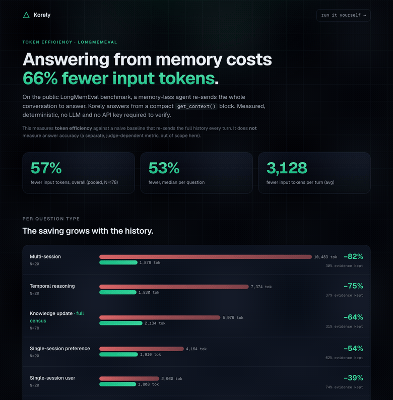

# Token efficiency on LongMemEval

**How many input tokens does an agent spend to answer, with and without a memory layer?**

On the public [LongMemEval](https://arxiv.org/abs/2410.10813) benchmark (oracle split, 178 questions across 6 question types), answering each question from **Korely's `get_context()` block** instead of re-sending the **full conversation history** cuts input tokens by

> ## 66% overall (median 62% per question).

You pay per input token, so this is a measured, reproducible cut to the bill. Everything here is **deterministic and verifiable with no API key and no LLM call**: it reads the run transcripts (Korely's block was logged at run time) and the public dataset, and counts tokens with a standard tokenizer. Don't trust us, run [`scripts/analyze.py`](scripts/analyze.py).

**Read this first.** This measures **token efficiency** (objective). It is measured against a deliberately naive baseline: an agent that re-sends the entire conversation on every turn. It does **not** measure answer accuracy (whether the compressed block is enough to answer correctly), which needs a neutral LLM judge and is out of scope here.

## Contents

- [Introduction — the question, and why we measured it this way](#introduction)
- [Dashboard](#dashboard)
- [Result](#result)
- [What "evidence retained" means (and what it does not)](#what-evidence-retained-means-and-what-it-does-not)
- [What is being measured](#what-is-being-measured)
- [Methodology and honest scope](#methodology--honest-scope)
- [Reproduce it](#reproduce-it)
- [Cost](#cost)
- [Citation](#citation)

## Introduction

An agent with no memory layer answers each turn by carrying its whole history in the prompt. That history grows every session, and you pay for it on every input token. A memory layer is supposed to replace the growing transcript with a small, relevant block. This page measures exactly one thing, as objectively as we can: **how many input tokens that swap saves.**

**The question.** For a fixed set of real questions over long, multi-session chat histories, how many input tokens does an agent spend to answer (a) by re-sending the full conversation, versus (b) by reading Korely's `get_context()` block instead?

**Why tokens and not an accuracy score.** Accuracy needs an LLM judge, and a judge is a moving, arguable part. Token counts are not: same prompt template, same tokenizer, count both sides, report the ratio. Anyone can rerun the arithmetic from the published transcripts with no API key and no model. We wanted the headline number to be the one nobody has to take on trust.

**The choices we made, and why:**

- **Public dataset, hardest-for-us split.** [LongMemEval](https://arxiv.org/abs/2410.10813), `oracle` split. Oracle keeps only the evidence sessions and drops the distractors, so the full history is as *small* as it gets. That makes our reduction a conservative lower bound: on the full long-context split the gap is larger, not smaller.
- **A deliberately naive baseline.** "Full history" means re-sending every turn. A real memory-less agent would window or truncate, so 66% is "versus an agent that re-sends everything", stated plainly, not "versus every possible alternative".
- **Only one thing changes.** The reader prompt is identical in both conditions; only the knowledge block differs. So the token delta is attributable to the memory layer and nothing else.
- **We report where it loses, too.** On very short conversations the ~2,000-token block is bigger than the whole history, so memory costs more. That row (`single-session-assistant`, -9%) is in the table, not hidden.

The rest of this page is the result, an interactive dashboard, the exact method, and two ways to reproduce it: for free from our published data, or against your own Korely.

## Dashboard



Interactive version: open [`dashboards/index.html`](dashboards/index.html) in any browser (self-contained, no server), or [view it rendered here](https://htmlpreview.github.io/?https://github.com/verdana86/korely-research/blob/main/token-savings/dashboards/index.html). Full still: [`dashboards/dashboard.png`](dashboards/dashboard.png). It regenerates from the results with `python scripts/build_dashboard.py`.

---

## Result

`tiktoken o200k_base` tokenizer · LongMemEval `oracle` split · Korely `get_context()` (native, ~2000-token soft budget) · N = 178.

| question type | N | full history (avg tok) | Korely (avg tok) | fewer | evidence retained |
|---|---:|---:|---:|---:|---:|
| multi-session | 20 | 10,483 | 1,878 | **82%** | 30% |
| temporal-reasoning | 20 | 7,374 | 1,830 | **75%** | 37% |
| knowledge-update *(full 78/78 census)* | 78 | 5,976 | 2,134 | **64%** | 31% |
| single-session-preference | 20 | 4,164 | 1,910 | **54%** | 62% |
| single-session-user | 20 | 2,960 | 1,808 | **39%** | 74% |
| single-session-assistant | 20 | 1,081 | 1,177 | **−9%** | 97% |
| **all (pooled)** | **178** | **5,547** | **1,902** | **66%** | **47%** |

Headline reductions, three ways, so the question mix isn't doing silent work: **pooled (token-weighted) 66%**, **per-question median 62% / mean 54%**, **dataset-axis re-weighted 60%**. They cluster in the 60s; the saving is real and grows with history length. Per-question rows: [`results/per_question.jsonl`](results/per_question.jsonl); aggregate: [`results/summary.json`](results/summary.json).

**The −9% row is reported, not hidden.** On `single-session-assistant` the whole conversation is ~1,080 tokens, already smaller than the ~2,000-token block, so memory adds overhead instead of saving. In total **20 of 178** questions cost more with Korely (19 of them single-session-assistant). The saving appears, and grows, where memory is meant to help: long histories (multi-session: 82%).

## What "evidence retained" means (and what it does not)

For every question, Korely's block keeps **at least one** of the question's gold answer-evidence turns (100% on all 178 — call it the floor). But on average it keeps only **47% of the gold-evidence turns** (median 38%): the block is a **compression** of the history, not a copy. That is the whole point of a memory layer.

Two honest consequences:
- **This is not a recall@k leaderboard number.** Korely's block embeds verbatim conversation turns under a "Relevant memories" header, so a substring "did a gold turn survive" test passes easily by construction. We report it as an evidence-retention floor, not as a discriminating retrieval score.
- **It says nothing about answer correctness.** Whether the 47%-retained, compressed block is *sufficient* to answer is the accuracy question, which needs a neutral judge and is **not** claimed here.

## What is being measured

For each LongMemEval question the reader LLM is given the **same** answer prompt, and only the knowledge block inside it changes:

```
Answer the question using ONLY the memory context below. ...
Memory context:
{CONTEXT}            <-- the only thing that differs

Question: {QUESTION}
Answer:
```

- **full history**: `{CONTEXT}` = every turn of the conversation, chronological. This is a **naive baseline**: a real memory-less agent would window, truncate, or cache instead of re-sending everything, so 66% is "vs an agent that re-sends the whole history", not "vs every possible alternative".
- **Korely**: `{CONTEXT}` = Korely's `GET /v1/context` block, the server-side memory for that question.

We tokenize **both** prompts with the same tokenizer and report the reduction.

## Methodology & honest scope

- **Dataset.** [LongMemEval](https://arxiv.org/abs/2410.10813) (Wu et al., 2024), public MIT mirror [`xiaowu0162/longmemeval-cleaned`](https://huggingface.co/datasets/xiaowu0162/longmemeval-cleaned), file `longmemeval_oracle.json`. The **oracle** split has only the answer-evidence sessions (no distractors), so the full history is as small as it gets and the reduction here is a **conservative lower bound**; on the full long-context split (`longmemeval_s`), histories run past the context window while the block stays small, so the reduction is far larger (a tracked follow-up).
- **Question mix.** `knowledge-update` is a full census (78/78). The other five axes are 20-question subsamples of a larger pool, and the `multi-session` 20 skew toward larger histories (which lifts that axis's 82%). The **overall** number is robust to this: pooled 66%, per-question median 62%, dataset-re-weighted 60%.
- **Tokenizer.** `tiktoken o200k_base` for both conditions, so the **ratio** is apples-to-apples. The actual reader was Llama-3.3-70B (different tokenizer); we expect the ratio to be broadly tokenizer-insensitive but have not measured the spread, so treat exact percentages as ±a few points.
- **Soft budget.** The block targets ~2,000 tokens but is not hard-capped: **65 of 178** blocks exceed it (max 2,566). It is a soft target; the reduction holds regardless. A larger budget would trivially raise evidence retention and lower the reduction, so the 66% / 47% pair is one point on a budget tradeoff, not a tuned sweet spot.
- **Objective, no judge.** Token counts and evidence retention need no LLM. **Answer accuracy** (% correct, judged) is a separate, judge-dependent metric and is **not** claimed here.
- **Source data.** `data/korely_longmemeval_oracle.jsonl` is one row per question; `retrieved_context` is Korely's actual `get_context()` output, logged verbatim.

## Reproduce it

**A. Verify the numbers ($0, no keys, no model)** straight from the published data + public dataset:

```bash
pip install tiktoken huggingface_hub
python scripts/analyze.py --transcripts "data/*.jsonl" --out results
```

**B. Regenerate on your own Korely.** Free key at [korely.ai/agents](https://korely.ai/agents):

```bash
export KORELY_API_KEY=kor_live_...
python scripts/reproduce.py --axis knowledge-update --n 20
python scripts/analyze.py --transcripts "results/repro-*.jsonl" --out results
```

Self-contained (no private harness): public dataset in, your Korely memory out, same math. Uses your write quota; the analysis stays free.

## Cost

Pooled, the full-history condition averages 5,547 input tokens/question vs 1,902 with Korely, i.e. **3,645 fewer input tokens per turn**. Multiply by your model's input price and your turn volume. Only the input shrinks (output is unaffected); the reduction is the same across providers, only the per-token price changes.

## Citation

> Wu, Di, et al. *LongMemEval: Benchmarking Chat Assistants on Long-Term Interactive Memory.* 2024. [arXiv:2410.10813](https://arxiv.org/abs/2410.10813).

Dataset mirror: [`xiaowu0162/longmemeval-cleaned`](https://huggingface.co/datasets/xiaowu0162/longmemeval-cleaned) (MIT).
